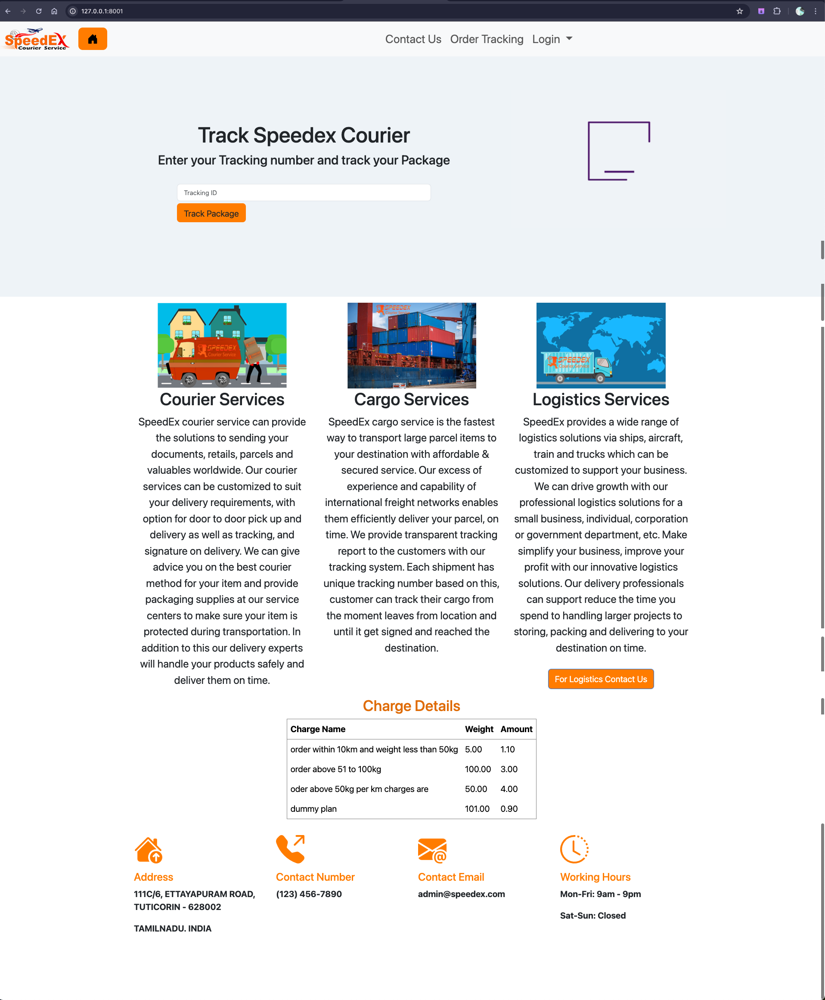
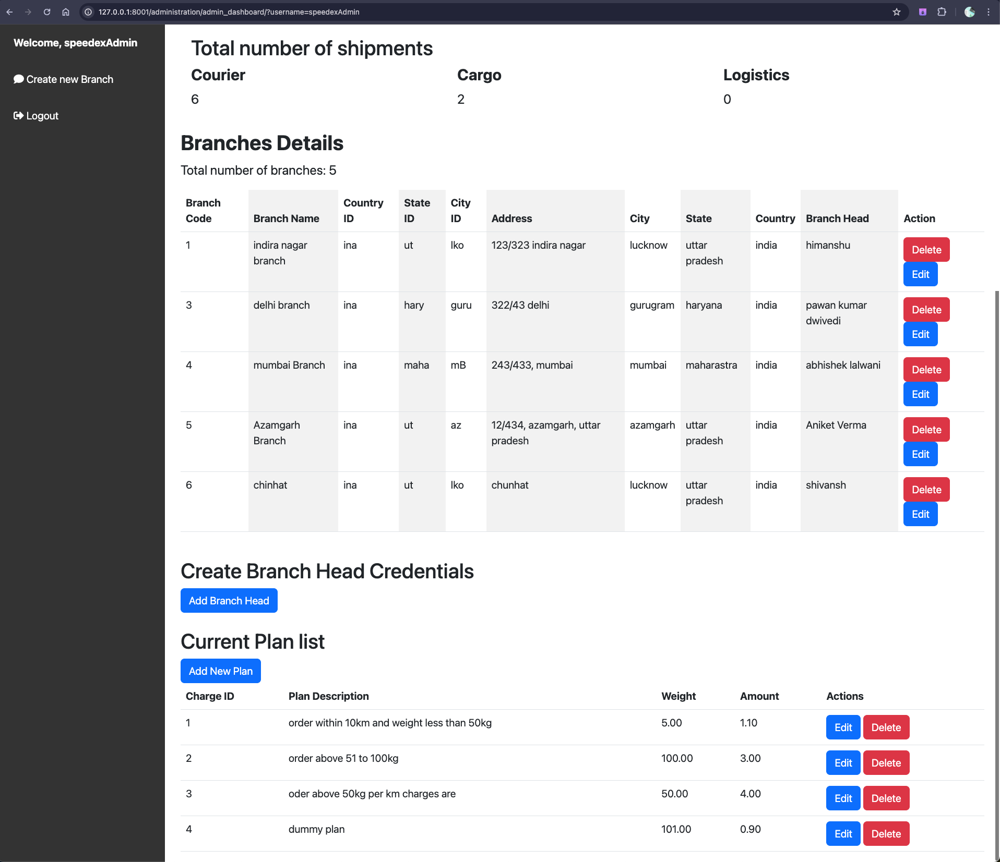
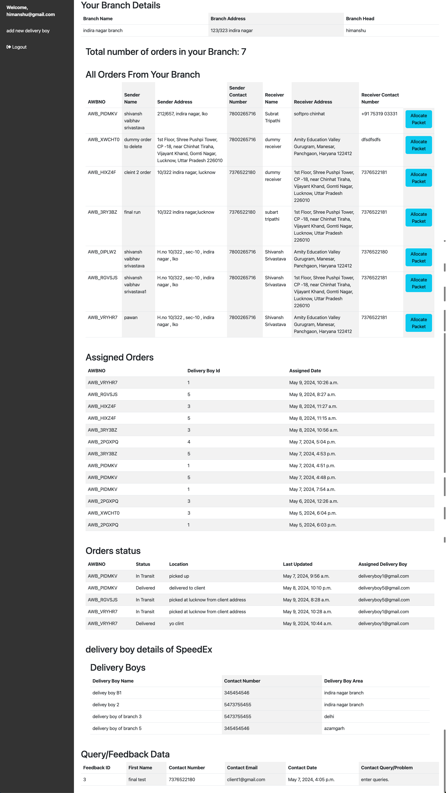
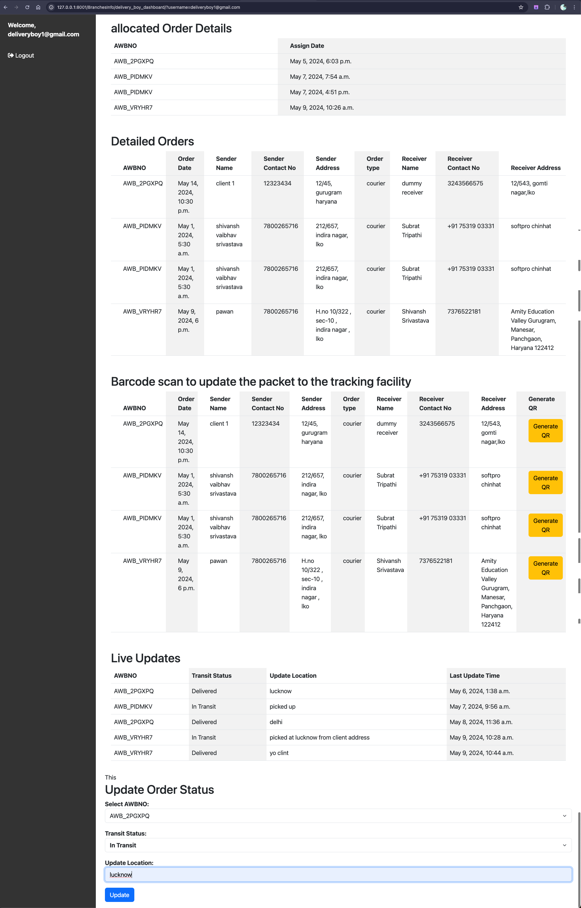
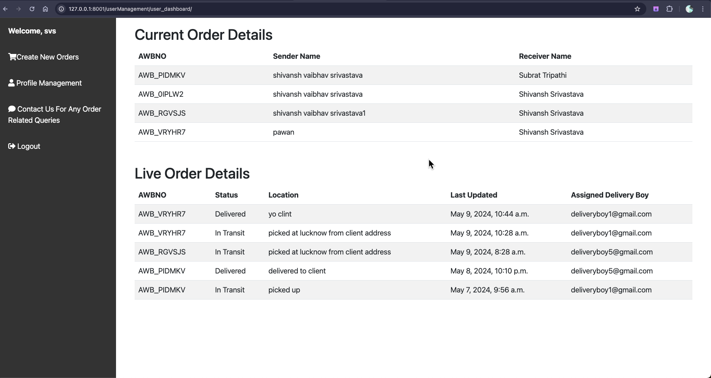
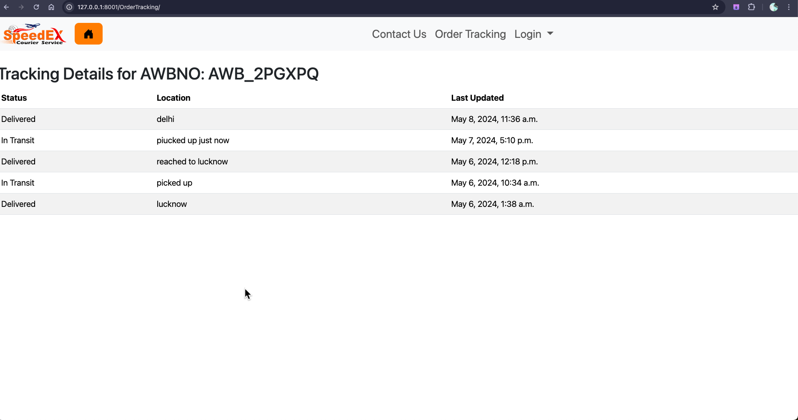
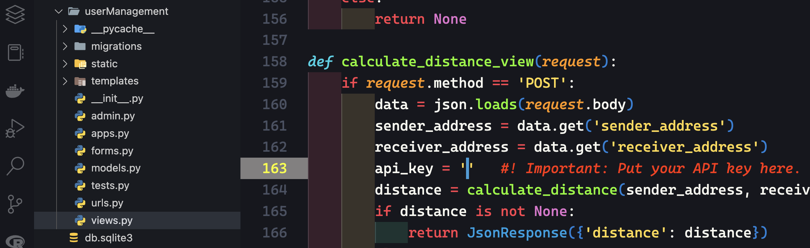

# BCA Final Year Project

## Project Title : The Courier Operation Management System

## Client : SPEEDEX Courier Service

# BCA-Project

This is a Django Based project to manage the courier operations and tracking in real time, to the client.

There are 4 main modules:

1. administration
2. BranchesInfo
3. homeapp
4. userManagement

---

#### administration

* In this module the company admin can see the total number of Packets based on their categories - courier, cargo, logistics. admin can also see the the number of Branches and it's details, with the functionality to create/delete branch and create credentials for the Branch Head to manage that perticular branch.
* In admin dashboard there section called plan list where he views, add, edit, delete the plans through which the orders price is calculated.

---

#### BranchesInfo

In this module all the critical operations takes place this module contains two user-type.

1. Branch head
2. delivery boy

###### Branch head

* In Branch head dashboard there is informations related to his branch like - branch name, branch address, and branch head.
* Next in his dashboard branch head can view total number of packets related to his branch with details - AWBNO, sender name, sender address, sender contact number, receiver name, receiver name, receiver address, receiver contact number with option to allocate that packet to the delivery person.
* Branch head also see the details of delivery boys with functionality to add new delivery boys.
* Packets updates is also monitored here realated to his branch.
* Query/Feedback given by clients to his specific branch is also shown in branch head dashboard.

###### Delivery Boy

* In delivery boy dashboard all packets/orders allocated to him by branch head is shown here, with required info such as - AWBNO, order date, sender name, sender address, sender contact number, receiver name, receiver contact number, receiver address.
* For tracking faclity there is option to generate QR Code which contains details like AWBNO, sender name, sender address, receiver name, receiver address, mode of payment at the time order is placed by the client.
* Last there is section to update the packet status with auto time stamp to tell the end-user and concerning branch head about the packet/order status like where the packet/order is reached with location.

---

#### homeapp

* This module contains home page of the website and  feedback, tracking realted forms where anyone with tracking id directly track their packet/order.

---

#### userManagement

* This module client login and sign-up option and packet/order form to place new orders [ for logged-in user only ].
* In client dashboard there are several options like - create new orders, profile management, feedback/queries option.
* In main dashboard he can see his orders with detials like AWBNO, sender name, receiver name
* Below that live order details are shown to provide information about the packet/order containing following informations - AWBNO, status, location, time [ date and time], delivery boy name by whom the status is updated for the specific packet/order.

---

#### Images related to different user's dashboard

##### home page



##### speedex admin dashboard



##### branch head dashboard



##### delivery boy dashboard



##### user dashboard



##### order traking directly from homepage



#### Installation

* All required pip packeges are there in requirements.txt
* If googlemaps doesn't install try this command

```
pip install googlemaps --use-pep517
```

* After installing all the packages, put your google distance matrix api key in order to calculate the distance between sender and receiver address.




* After installing all packeges, run the Django Project by entering the command.

```
python manage.py runserver
```


Credentials and Password for django admin superuser is

username- shivanshvaibhav

password-1234

From django superuser pannel you can see the rest of the credentials for all users under tables - admin_tables, Branch_heads, Delivery_boy_details, login_infos.
